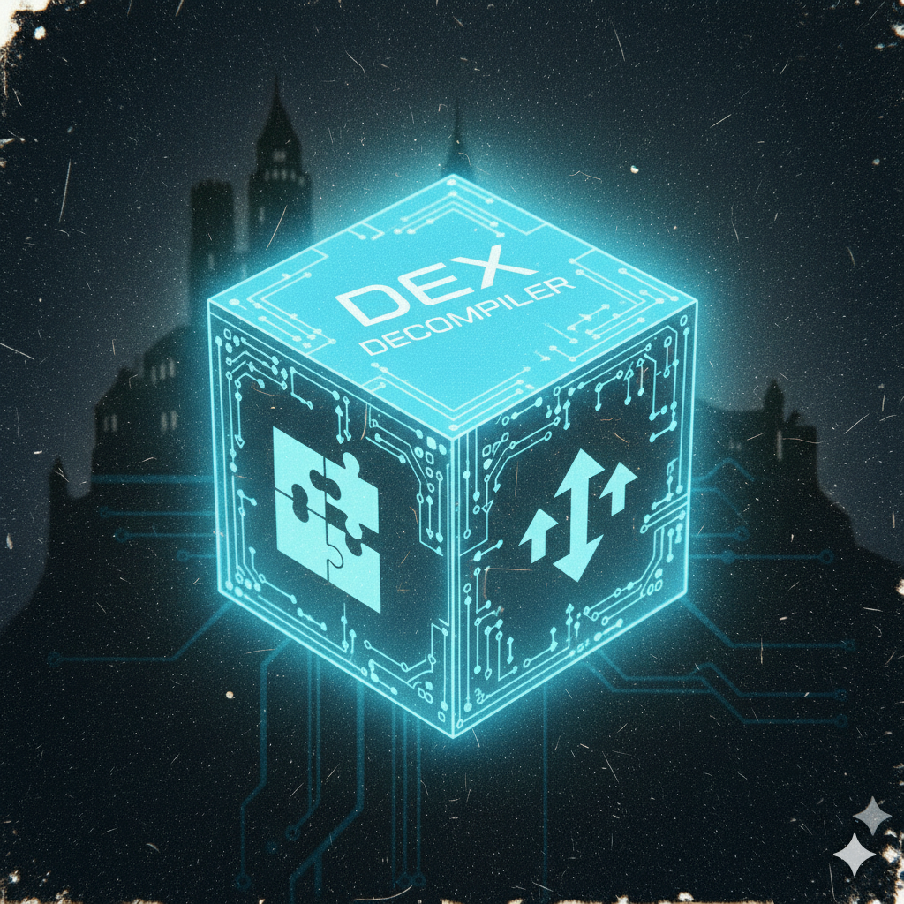

# dex-decompiler

<p align="center"></p>
<h2 align="center">DEX-DECOMPILER</h2>

A **DEX to Java decompiler** in pure Rust. It parses DEX files, disassembles Dalvik bytecode, and emits Java-like source with structured control flow.

## How the decompiler works

```
  ┌─────────────┐
  │  DEX bytes  │
  └──────┬──────┘
         │
         v  dex-parser
  ┌─────────────┐     ┌──────────────────┐
  │  DexFile    │────>│ header, strings, │
  │  (in-memory)│     │ types, methods,   │
  │             │     │ class_defs, code  │
  └──────┬──────┘     └──────────────────┘
         │
         v  dex-bytecode (decode_all)
  ┌─────────────┐
  │ Instruction │   Raw Dalvik: const/4, move, if-eqz, invoke-virtual, ...
  │   stream    │
  └──────┬──────┘
         │
         v  basic_blocks + CFG (MethodCfg)
  ┌─────────────┐     ┌─────────────────────────────────────────┐
  │  CFG       │────>│ Blocks, edges, loop headers,              │
  │  (per meth)│     │ instruction_offsets per block            │
  └──────┬──────┘     └─────────────────────────────────────────┘
         │
         v  instructions_to_ir (per block)
  ┌─────────────┐     ┌─────────────────────────────────────────┐
  │  IR        │────>│ Assign { dst, rhs }, Expr, Return, Raw    │
  │  (IrStmt)  │     │ VarId(reg, ver), Call, PendingResult       │
  └──────┬──────┘     └─────────────────────────────────────────┘
         │
         v  PassRunner (InvokeChain, SsaRename, DeadAssign)
  ┌─────────────┐     invoke+move-result+return → Return(Call)
  │  IR (clean) │     dead stores removed (with method-wide used regs)
  └──────┬──────┘
         │
         v  build_regions (if/else, while, switch)
  ┌─────────────┐     ┌─────────────────────────────────────────┐
  │  Region     │────>│ Tree: Block, If(cond,then,else),          │
  │  tree       │     │ Loop(header, body), Switch(cases, default)│
  └──────┬──────┘     └─────────────────────────────────────────┘
         │
         v  emit_region + codegen_ir_lines
  ┌─────────────┐
  │  Java-like  │     Class/method signatures, fields, bodies
  │  source     │     (type inference + var names from IR)
  └─────────────┘
```

**Value flow / tainting** (optional): from the same CFG and a per-instruction read/write map, reaching definitions and def-use/use-def are computed. Given a seed `(offset, reg)`, `value_flow_from_seed` returns all program points that **read** or **write** that value—including when the value is **returned**, **passed to a function** (invoke arg), or copied through moves. **API-source tainting**: `value_flow_from_api_sources(patterns)` treats every `move-result` that receives the return of a matching `invoke` (e.g. `FusedLocationProviderClient.getLastLocation()`) as a seed. **Multi-DEX**: the CLI accepts multiple `-i` inputs; taint mode searches for `CLASS#METHOD` in each DEX in order.

## Features

- **Pure Rust**: No JVM or external tools.
- **DEX parsing**: Full parsing of DEX format (header, string_ids, type_ids, proto_ids, field_ids, method_ids, class_defs, class_data_item, code_item) via [dex-parser](https://github.com/androguard/dex-parser/tree/main/dexparser-rs).
- **Disassembly**: Uses [dex-bytecode](https://github.com/androguard/dex-bytecode) for linear-sweep Dalvik instruction decoding and CFG (basic blocks).
- **Structured control flow**: if/else, `while (!cond)` and `while (true)` with break/continue, **for loops** (init; cond; update), **packed-switch / sparse-switch** → `switch (var) { case … default: … }`.
- **SSA-style IR**: Versioned vars, type inference (params, return, propagation), dead-assign pass with method-wide used regs.
- **Java emission**: Class and method signatures, field declarations, method bodies as Java-like source; optional raw DEX instruction listing as comments before each method.
- **Imports**: Per-class import block; short names in body (e.g. `java.lang.String` → `String`).
- **Try/catch**: From DEX try_item and encoded_catch_handler; body wrapped in `try { … } catch (Type e) { … }` with type names.
- **Enum**: Class extends `java.lang.Enum` and has static final fields of its own type → emitted as `enum Name { A, B, C; … }` (constants first, then `;`, then other members).
- **Annotations**: Class annotations from annotations_directory_item → `@Name` before the class.
- **Constructors**: Emitted as `ClassName(params)` (not `void <init>()`); parameterless `<init>()` in body → `super();`.
- **Anonymous Thread inlining**: Pattern `X.<init>(args);` + `X.start();` → inlined `new Thread() { public void run() { … } }.start();` with inner `run()` body and capture replacement (e.g. `val$o` → outer variable); **synchronized** blocks from monitor-enter/exit; unreachable exception-handler lines after `return;` stripped.
- **Library API**: Parse DEX, decompile classes/methods, **find_method**, get **per-method bytecode and CFG** (nodes/edges) for visualization or tooling.
- **Value flow / tainting**: Reaching definitions, def-use/use-def, propagation from seed or from API sources (e.g. `getLastLocation`).
- **Vulnerability detectors**: PendingIntent scan (`--scan-pending-intent`), full scan (`--scan-vulns`: intent spoofing, RCE, insecure logging, SQL injection, WebView, hardcoded-secrets, IPC).
- **Progress**: With `--output-dir`, progress bar shows current class being decompiled.

## Simplifications

Method bodies and IR are simplified so output looks like idiomatic Java.

### IR passes (before emission)

- **InvokeChainPass**: `invoke(...); vN = <result>; return vN;` → `return method(args);`; `invoke(...); vN = <result>;` → `vN = method(args);`; `invoke(...); return;` left as call + return.
- **ConstructorMergePass**: `vN = new Foo();` + `vN.<init>(args);` → `vN = new Foo(args);` (when in same block).
- **SsaRenamePass**: SSA-style versioned variables.
- **DeadAssignPass**: Removes dead stores (with method-wide used regs).
- **ExprSimplifyPass**: `v0 = v0 + 1` → `v0++`, `v0 = v0 + x` → `v0 += x`; removes redundant self-assigns.

### Method-body simplifications (after emission)

- **Invoke + move-result + return**: `invoke(...); vN = <result>; return vN;` → `return method(args);`.
- **Invoke + move-result**: `invoke(...); vN = <result>;` → `vN = method(args);`.
- **Invoke + return void**: `invoke(...); return;` → `method(args); return;`.
- **Ternary**: `if (cond) { return a; } else { return b; }` → `return cond ? a : b;`.
- **String concatenation**: `new StringBuilder(); sb.append(a); sb.append(b); s = sb.toString();` → `s = a + b;` (and `return sb.toString();` → `return a + b;`).
- **Arithmetic**: `x + -N` → `x - N`.
- **Constructors**: In constructor bodies only, `receiver.<init>();` (no args) → `super();`.
- **Synchronized**: `try { /* monitor-enter(lock) */ … /* monitor-exit */ } catch (Throwable …)` → `synchronized (lock) { … }` (run after try/catch wrapping).
- **Unreachable code**: Lines after `return;` with greater indent are skipped until `}` or `} catch`.
- **Unreachable exception junk** (in inlined Thread run): After `return;`, lines containing `/* move-exception */`, `/* monitor-exit(...) */`, or `throw …;` are removed.


## Dependencies

- [dex-bytecode](https://github.com/androguard/dex-bytecode) – Dalvik disassembly and CFG (basic blocks, switch expansion).
- [dex-parser](https://github.com/androguard/dex-parser/tree/main/dexparser-rs) – DEX file parsing.

Both are pulled from GitHub in `Cargo.toml`; no local paths required.

## Run

```bash
cargo run --release --bin dex-decompile -- -i classes.dex
```
This builds (if needed) and runs the decompiler. See [Usage](#usage) below for more options.

**Speed:** For large DEX files, always use `--release` (e.g. `cargo run --release --bin dex-decompile -- -i classes.dex -d out`). With `-d`/`--output-dir`, decompilation is parallelized, files are written on the fly, and work is split into many chunks for better load balance.

## Usage

### CLI

```bash
# Decompile a DEX file to stdout
cargo run --bin dex-decompile -- -i classes.dex

# Decompile to a single Java file
cargo run --bin dex-decompile -- -i classes.dex -o Main.java

# Decompile to a directory with package structure (e.g. out/com/example/MyClass.java)
cargo run --bin dex-decompile -- -i classes.dex -d out

# Only decompile classes in a package (and subpackages)
cargo run --bin dex-decompile -- -i classes.dex -d out --only-package com.example

# Exclude packages (may be repeated; supports trailing . or .*)
cargo run --bin dex-decompile -- -i classes.dex -d out --exclude android. --exclude kotlin.

# Multi-DEX: taint mode searches for CLASS#METHOD in each file in order
cargo run --bin dex-decompile -- -i classes.dex -i classes2.dex --taint-method "com.example.Main#onCreate" --taint-api getLastLocation

# Data flow / tainting: show where value (offset, reg) is read/written in a method
cargo run --bin dex-decompile -- -i classes.dex --taint-method "com.example.Main#onCreate" --taint-offset 0x4 --taint-reg 0

# Taint returns of Android API methods (e.g. getLastLocation)
cargo run --bin dex-decompile -- -i app.dex --taint-method "com.example.Main#onCreate" --taint-api getLastLocation --taint-api getCurrentLocation
```

| Option | Short | Description |
|--------|--------|-------------|
| `--input` | `-i` | Input DEX file path(s). May be repeated for **multi-DEX** apps (e.g. `classes.dex`, `classes2.dex`). Taint mode searches for `CLASS#METHOD` in each file in order; decompile uses the first file. |
| `--output` | `-o` | Output Java file (single file); default: stdout. |
| `--output-dir` | `-d` | Output directory: one `.java` per class under package structure. Decompilation is parallelized for large DEX files. |
| `--only-package` | | Only decompile classes in this package (e.g. `com.example`). Subpackages included. |
| `--exclude` | | Exclude classes in this package (e.g. `android.`). Repeatable. |
| `--taint-method` | | Data flow: method as `CLASS#METHOD` (e.g. `com.example.Main#onCreate`). Use with `--taint-offset` and `--taint-reg`, or with `--taint-api`. |
| `--taint-offset` | | Instruction byte offset for taint seed (decimal or `0x` hex). Offsets are relative to the method's code start. |
| `--taint-reg` | | Register number for taint seed (e.g. `0` for v0). |
| `--taint-api` | | Taint returns of Android API methods (e.g. `getLastLocation`, `FusedLocationProviderClient.getLastLocation`). Repeatable; matches if method ref contains the pattern. |
| `--scan-pending-intent` | | Scan all methods for PendingIntent creation sites (PITracker-like). Reports whether the base Intent has modifiable fields set and whether the PendingIntent flows to a dangerous sink (e.g. Notification). See [PITracker (WiSec'22)](https://diaowenrui.github.io/paper/wisec22-zhang.pdf). |
| `--show-bytecode` | | Emit raw DEX instructions as comments before each method body (for debugging). |
| `--scan-vulns` | | Run all vulnerability detectors on every method: intent spoofing, RCE (dynamic code loading), insecure logging, SQL injection, WebView (unsafe URL + JavaScriptInterface), hardcoded-secrets review, IPC intent validation. Optional: use with `--taint-api` to add logging sources. |

When `--output-dir` is set, progress is shown per class. When `--taint-method` is set with either (`--taint-offset` and `--taint-reg`) or `--taint-api`, the tool prints value-flow (reads/writes) and exits without decompiling. When `--scan-pending-intent` is set, the tool scans every method for PendingIntent creation and prints a risk report. When `--scan-vulns` is set, the tool runs all detectors and prints one line per finding (category, class#method, sink offset, sink method). When both `-o` and `-d` are omitted and neither taint nor scan is used, decompiled Java is printed to stdout.

### Library

```rust
use dex_decompiler::{parse_dex, Decompiler, DecompilerOptions, CfgEdgeInfo, CfgNodeInfo, MethodBytecodeRow};

let data = std::fs::read("classes.dex")?;
let dex = parse_dex(&data)?;

// Decompile entire DEX or with filters
let options = DecompilerOptions {
    only_package: Some("com.example".into()),
    exclude: vec!["android.".into()],
    ..Default::default()
};
let decompiler = Decompiler::with_options(&dex, options);
let java = decompiler.decompile()?;

// Per-method bytecode and CFG (for graphs, web UI, etc.)
let encoded = /* EncodedMethod from class_data */;
let (rows, nodes, edges) = decompiler.get_method_bytecode_and_cfg(encoded)?;
// rows: Vec<MethodBytecodeRow> { offset, mnemonic, operands }
// nodes: Vec<CfgNodeInfo> { id, start_offset, end_offset, label }
// edges: Vec<CfgEdgeInfo> { from_id, to_id }
```

### Value flow / data tainting

To see **where a specific value is read/written** in a method (data tainting), use value-flow analysis. The tracker follows the value when it is **returned**, **passed to a function** (invoke argument), or copied through moves:

```rust
use dex_decompiler::{parse_dex, Decompiler, ValueFlowAnalysisOwned};

let dex = parse_dex(&data)?;
let decompiler = Decompiler::new(&dex);
let encoded = /* EncodedMethod from class_data */;
let owned = decompiler.value_flow_analysis(encoded)?;

// Seed: value in register at instruction offset (relative to method code start)
let result = owned.analysis().value_flow_from_seed(0x0004, 0);
// result.reads: all (offset, reg) that read that value (e.g. return v1, invoke v1)
// result.writes: all (offset, reg) that write it (seed + copies, e.g. move v1,v0)

// Def-use: for a def (offset, reg), list uses
let uses = owned.analysis().def_use(0x0004, 0);
// Use-def: for a use (offset, reg), list reaching defs
let defs = owned.analysis().use_def(0x0010, 0);

// Taint returns of Android API methods (e.g. FusedLocationProviderClient.getLastLocation)
let result = owned.value_flow_from_api_sources(&["getLastLocation", "FusedLocationProviderClient.getLastLocation"]);
// result.reads / result.writes: union of all seeds matching the patterns
```

**Complex examples (propagation via params and return):**

1. **One value flows to both a function call (param) and to return**  
   Pseudocode: `v0 = source(); v1 = v0; foo(v1); v2 = v0; return v2;`  
   Seed at the def of `v0`. Then `result.reads` includes the **invoke** (v1 passed as param) and the **return** (v2); `result.writes` includes the seed and both copies (v1, v2).

2. **Value returned from a callee propagates to this method's return**  
   Pseudocode: `bar(); v0 = result; v1 = v0; return v1;`  
   Seed at **move-result** (e.g. from `value_flow_from_api_sources("getLastLocation")`). Then `result.writes` includes move-result v0 and move v1; `result.reads` includes the **return** v1.

The analysis uses **reaching definitions** over the CFG and per-instruction read/write sets (move, const, return, invoke, if-*, binary ops, iget/iput, etc.). Offsets in value-flow results are **relative to the method's code start** (0, 2, 4, …).

**Vulnerabilities this tainting can help find** — Top Android security issues that map to "sensitive source → dangerous sink" data flow. Use `--taint-api` (or a seed) as the source; then inspect `result.reads` for invokes that are sinks (network, log, SQL, WebView, etc.):

| Vulnerability | Sensitive source (seed) | Sensitive sink |
|---------------|------------------------|----------------|
| **Location / PII leakage** | `getLastLocation`, `getCurrentLocation` | Network, Log, file, Intent |
| **Device ID / IMEI leakage** | `getDeviceId`, `getSubscriberId`, `getAndroidId` | Network, log |
| **Clipboard leakage** | `getPrimaryClip`, `getText` (ClipboardManager) | Network, log |
| **Intent / user input injection** | `getIntent().getStringExtra`, `EditText.getText` | `startActivity`, `WebView.loadUrl`, `rawQuery`/`execSQL` |
| **SQL injection** | User input (intent extras, EditText) | `rawQuery`, `execSQL` |
| **Path traversal** | Intent extras, user input | `File(path)`, `openFileOutput` |
| **Insecure WebView** | Intent extras, user input | `WebView.loadUrl`, `loadDataWithBaseURL` |
| **Sensitive data in logs** | Location, IMEI, tokens, clipboard | `Log.d`, `Log.i`, `println` |

Today the tool gives you **all program points (reads/writes)** for a seed; you (or a sink matcher) check whether any read is an invoke to a dangerous sink. Adding **sink patterns** (e.g. method ref contains `Log.`, `OkHttp`, `rawQuery`) would enable automatic vulnerability reports.

### Python bindings

A [PyO3](https://pyo3.rs/) / [maturin](https://www.maturin.rs/) crate in **`dex-decompiler-py/`** exposes the decompiler to Python:

```bash
cd dex-decompiler-py && maturin build --release && pip install target/wheels/dex_decompiler-*.whl
```

```python
import dex_decompiler

dex = dex_decompiler.parse_dex(open("classes.dex", "rb").read())
java_src = dex.decompile()
dex.decompile_to_dir("out/")
method_java = dex.decompile_method("com.example.MainActivity", "onCreate")
bytecode_rows, cfg_nodes, cfg_edges = dex.get_method_bytecode_and_cfg("com.example.MainActivity", "onCreate")
```

See [dex-decompiler-py/README.md](dex-decompiler-py/README.md) for full API and installation options.

## Tests

Tests mirror [androguard decompiler tests](https://github.com/androguard/androguard/tree/master/tests):

- **Graph / RPO**: `src/decompile/graph.rs` – immediate dominators and reverse post-order (Tarjan, Cross, LinearVit, etc.).
- **Dataflow**: `tests/decompiler/dataflow.rs` – reach-def, def-use, group_variables (GCD, IfBool).
- **Control flow**: `tests/decompiler/control_flow.rs` – return, if/else, while, loop exit.
- **Equivalence**: `tests/decompiler/equivalence.rs` – parse-fail, minimal DEX, try/catch comment, switch packed cases. Optional tests for simplification and arrays run only if androguard test data exists under `tests/data/APK/` (Test.dex, FillArrays.dex).
- **Value flow / tainting**: `src/decompile/value_flow.rs` (unit) and `tests/decompiler/value_flow.rs` (integration) – reaching definitions, def-use/use-def, propagation from a seed (return, pass to function, transitive copies, complex flows: param+return, callee return→return).

```bash
cargo test
cargo test -- --ignored   # with fixture DEXs
```

## References

- [Android DEX format](https://source.android.com/docs/core/runtime/dex-format)
- [Dalvik bytecode](https://source.android.com/docs/core/runtime/dalvik-bytecode)
- [androguard decompiler](https://github.com/androguard/androguard/tree/master/androguard/decompiler)
- [jadx](https://github.com/skylot/jadx/tree/master/jadx-core/src/main/java/jadx)

## License

Same as the repository (see [LICENSE](LICENSE)).
